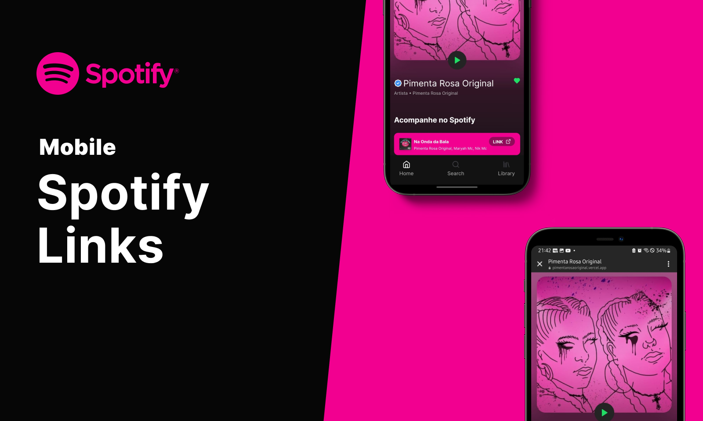

# Spotify Links (pt-BR)
[](#)
***Links Aggregator for Instagram***

> Status: Finished... ✅

## Technologies 🚀


## Libs 📕

📑 **Lucide ICONS**

📑 **ESLINT**

## Features 💡

✅ **ARTIST LINKS**

✅ **ARTIST PORTFOLIO**

## How do use the project ⚙️

### 1. Clone the repository
```sh
git clone https://github.com/reinheimermat/pimenta-rosa
```
### 2. install dependencies
```sh
npm install
```

### 3. Run local project
```sh
npm run dev
```
### 4. Access the project
```sh
http://localhost:5173/
```

## License 📝

[](https://github.com/Ileriayo/markdown-badges/blob/master/LICENSE)

## Links 🔗

[](https://www.linkedin.com/in/reinheimermat/)
[](mailto:contatoreinheimer@gmail.com)